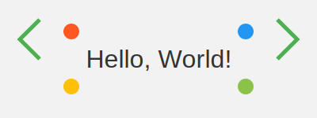

# multi-language-hello-world



---

# "Hello, World!" Examples

Welcome to the "Hello, World!" repository! This README provides examples of the classic "Hello, World!" program in a variety of programming languages. This simple program is often used as a first step in learning a new language or framework.

---
1. Python
2. C
3. C++
4. Java
5. JavaScript
6. Go
7. Ruby
8. PHP
9. Swift
10. Kotlin
11. Perl
12. R
13. C#
14. TypeScript
15. SCSS
16. Bash
17. HTML (with JavaScript)
18. Scala
19. Rust
20. Lua
21. MATLAB
22. Haskell
23. Elixir
24. F#
25. Fortran
26. Objective-C
27. VBScript
28. Assembly (x86)
29. Tcl
30. Julia
31. Groovy
32. SAS
33. Ada
34. Logo
35. OCaml
36. Prolog
37. Smalltalk
38. ActionScript
39. GAMS
40. HCL
41. Raku
42. Racket
43. Eiffel
44. Zig
45. COBOL
46. Dylan
47. Mercury
48. Pony
49. J
50. Haxe
51. Scratch
52. OpenCL
53. VHDL
54. LabVIEW
55. GDL
56. SASL
57. Z80 Assembly
58. Zsh
59. Pike
60. Turing
61. Icon
62. Fantom
63. LiveCode
64. XBase
65. OpenEdge ABL
66. Jinja2
67. Chapel
68. GDL
69. GAMS (repeated)
    
---
## Examples

### Python
```python
print("Hello, World!")
```

### C
```c
#include <stdio.h>

int main() {
    printf("Hello, World!\n");
    return 0;
}
```

### C++
```cpp
#include <iostream>

int main() {
    std::cout << "Hello, World!" << std::endl;
    return 0;
}
```

### Java
```java
public class HelloWorld {
    public static void main(String[] args) {
        System.out.println("Hello, World!");
    }
}
```

### JavaScript
```javascript
console.log("Hello, World!");
```

### Go
```go
package main

import "fmt"

func main() {
    fmt.Println("Hello, World!")
}
```

### Ruby
```ruby
puts "Hello, World!"
```

### PHP
```php
<?php
echo "Hello, World!";
?>
```

### Swift
```swift
import Swift

print("Hello, World!")
```

### Kotlin
```kotlin
fun main() {
    println("Hello, World!")
}
```

### Perl
```perl
print "Hello, World!\n";
```

### R
```r
cat("Hello, World!\n")
```

### C#
```csharp
using System;

class Program {
    static void Main() {
        Console.WriteLine("Hello, World!");
    }
}
```

### TypeScript
```typescript
console.log("Hello, World!");
```

### SCSS
```scss
// SCSS is for styling and doesn’t directly output to the console.
.hello-world {
    content: "Hello, World!";
}
```

### Bash
```bash
echo "Hello, World!"
```

### HTML (with JavaScript)
```html
<!DOCTYPE html>
<html>
<head>
    <title>Hello, World!</title>
</head>
<body>
    <script>
        document.write("Hello, World!");
    </script>
</body>
</html>
```

### Scala
```scala
object HelloWorld {
  def main(args: Array[String]): Unit = {
    println("Hello, World!")
  }
}
```

### Rust
```rust
fn main() {
    println!("Hello, World!");
}
```

### Lua
```lua
print("Hello, World!")
```

### MATLAB
```matlab
disp('Hello, World!')
```

### Haskell
```haskell
main = putStrLn "Hello, World!"
```

### Elixir
```elixir
IO.puts "Hello, World!"
```

### F#
```fsharp
printfn "Hello, World!"
```

### Fortran
```fortran
program hello
    print *, "Hello, World!"
end program hello
```

### Objective-C
```objc
#import <stdio.h>

int main() {
    printf("Hello, World!\n");
    return 0;
}
```

### VBScript
```vbscript
MsgBox "Hello, World!"
```

### Assembly (x86)
```asm
section .data
    msg db 'Hello, World!', 0

section .text
    global _start

_start:
    ; write syscall
    mov eax, 4
    mov ebx, 1
    mov ecx, msg
    mov edx, 13
    int 0x80

    ; exit syscall
    mov eax, 1
    xor ebx, ebx
    int 0x80
```

### Tcl
```tcl
puts "Hello, World!"
```

### Julia
```julia
println("Hello, World!")
```

### Groovy
```groovy
println "Hello, World!"
```

### SAS
```sas
data _null_;
    put "Hello, World!";
run;
```

### Ada
```ada
with Ada.Text_IO; use Ada.Text_IO;

procedure Hello_World is
begin
    Put_Line("Hello, World!");
end Hello_World;
```

### Logo
```logo
print [Hello, World!]
```

### OCaml
```ocaml
print_endline "Hello, World!"
```

### Prolog
```prolog
:- initialization(main).

main :-
    write('Hello, World!'), nl,
    halt.
```

### Smalltalk
```smalltalk
'Hello, World!' displayNl.
```

### ActionScript
```actionscript
trace("Hello, World!");
```

### GAMS
```gams
display "Hello, World!";
```

### HCL
```hcl
output "hello_world" {
  value = "Hello, World!"
}
```

### Raku
```raku
say "Hello, World!"
```

### Racket
```racket
#lang racket
(displayln "Hello, World!")
```

### Eiffel
```eiffel
class HELLO_WORLD
create
    make
feature
    make
        do
            io.put_string ("Hello, World!%N")
        end
end
```

### Zig
```zig
const std = @import("std");

pub fn main() void {
    std.debug.print("Hello, World!\n", .{});
}
```

### COBOL
```cobol
IDENTIFICATION DIVISION.
PROGRAM-ID. HelloWorld.

PROCEDURE DIVISION.
    DISPLAY "Hello, World!".
    STOP RUN.
```

### Dylan
```dylan
format-out("Hello, World!~%");
```

### Mercury
```mercury
:- module hello.
:- interface.
:- pred main(io::di, io::uo) is det.

:- implementation.
main(!IO) :-
    io.write_string("Hello, World!\n", !IO).
```

### Pony
```pony
actor Main
  new create(env: Env) =>
    env.out.print("Hello, World!")
```

### J
```j
'Hello, World!'
```

### Haxe
```haxe
class Main {
    static function main() {
        trace("Hello, World!");
    }
}
```

### Raku
```raku
say "Hello, World!"
```

---
